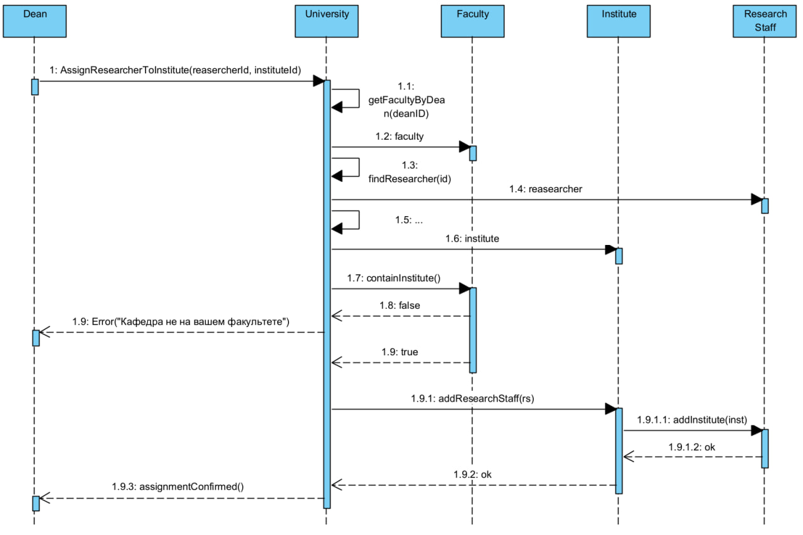
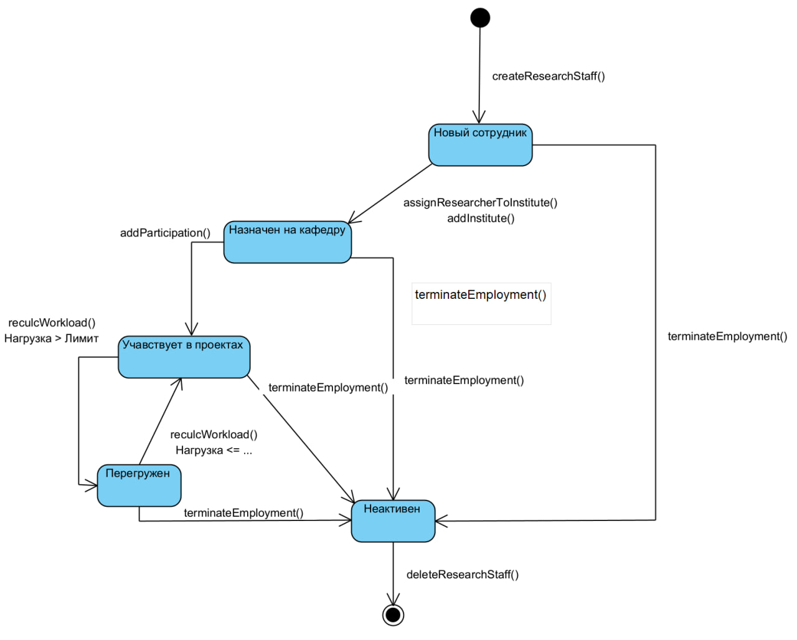
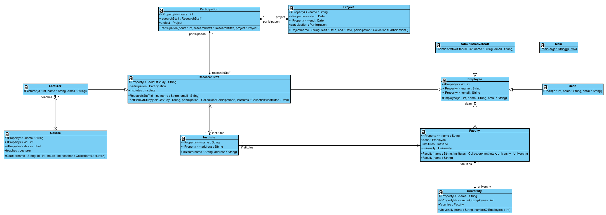

# Университетская информационная система  
Лабораторная работа №10 (UML моделирование)

## Описание проекта
Данная лабораторная работа представляет UML-модель и программную реализацию  
**университетской информационной системы**.  

Основная цель — построить согласованный набор UML-диаграмм и реализовать код,  
моделирующий научно-педагогический состав университета.

# Use Case Diagram  

Диаграмма демонстрирует основные прецеденты использования системы  
для четырёх типов сотрудников университета: декана, преподавателя,  
научного сотрудника и административного персонала.  
Каждый пользователь взаимодействует с системой в рамках своих полномочий.

## Основные акторы:

- **Dean (Декан)** — управляет исследовательским составом и контролирует нагрузку;
- **Lecturer (Преподаватель)** — ведёт курсы и просматривает учебную нагрузку;
- **Research Staff (Научный сотрудник)** — участвует в проектах,  
  просматривает занятость и данные;
- **Administrative Staff (Административный персонал)** — ведёт записи и  
  обслуживает внутренние данные системы;
- **Employee** — обобщённый актор для всех категорий сотрудников.

## Основные прецеденты:

- *View projects / employee workload* — просмотр проектов и нагрузки сотрудников;
- *View faculty staff* — просмотр состава факультета;
- *Assign researchers to departments* — назначение научных сотрудников на кафедры;
- *View your courses* — просмотр перечня курсов преподавателя;
- *Lead the course* — управление курсом;
- *View the training load* — контроль учебной нагрузки;
- *View departments* — просмотр кафедр;
- *View projects* — просмотр проектов;
- *View employment* — просмотр занятости;
- *View data* — просмотр внутренних данных;
- *Keep records* — ведение внутренних учётных данных  
  (include-прецеденты: *Maintain employees*, *Maintain departments*,  
  *Maintain workload data*).

Все прецеденты реализуются в рамках одной системы  
**“Университетская информационная система”**, что соответствует  
требованиям задания.

## Диаграмма:

# Class Diagram  
**Структурное представление сущностей “Университетской информационной системы”.**  

Диаграмма классов разработана на основе текстовых требований.  
Каждый класс отражает ключевые сущности предметной области: сотрудников,  
структурные подразделения университета, проекты, курсы и связи между ними.

## Иерархия сотрудников:

Базовый класс:
- **Employee**  
  Атрибуты: *id*, *name*, *email*.  
  Подклассы:
  - **Dean** — руководит факультетом;  
  - **ResearchStaff** — участвует в проектах, имеет атрибут *fieldOfStudy*;  
  - **AdministrativeStaff** — ведёт документацию;  
  - **Lecturer** — ведёт один или несколько курсов.

## Структурные элементы университета:

- **University**  
  содержит множество факультетов и хранит число сотрудников.

- **Faculty**  
  имеет атрибут *name* и композицию с *Institute*:  
  факультет включает в себя одну или несколько кафедр.  
  У факультета есть декан (ассоциация 0..1 с Dean).

- **Institute**  
  представляет кафедру, содержит имя, адрес, а также связи:
  - 1..* с ResearchStaff (кафедра содержит научных сотрудников),
  - 1..1 с Faculty (композиция),
  - 0..* с Project через Participation.

## Курсы и преподавание:

- **Course**  
  характеризуется названием, часами и ID.  
  Преподаватели (Lecturer) ведут один или несколько курсов.

## Проекты и участие:

- **Project**  
  содержит название и диапазон дат (start, end).  

- **Participation** — ассоциативный класс между Project и ResearchStaff.  
  Хранит параметр *hours*, отражающий вклад сотрудника в проект.

## Ключевые связи:

- Employee → Dean / ResearchStaff / Lecturer / AdministrativeStaff  
  (обобщение-наследование).
- University → Faculty → Institute (композиция).
- Institute ↔ ResearchStaff (двунаправленная ассоциация 1..* ↔ 1..*).
- Lecturer → Course (ассоциация 1..*).
- ResearchStaff ↔ Project через Participation (association class).

## Диаграмма:

# Sequence Diagram
**Диаграмма последовательности для прецедента использования  
«Назначить исследователя на кафедру» (Assign researchers to departments)**  

Данная диаграмма отражает поведение системы в рамках одного из ключевых прецедентов Use Case Diagram.  
Актор — декан факультета — инициирует назначение научного сотрудника на кафедру.  
Все объекты диаграммы являются экземплярами классов, представленных на Class Diagram.

## Логика взаимодействия:

1. **Декан** выбирает сотрудника и кафедру, после чего инициирует сценарий  
   `assignResearcherToInstitute(researcherId, instituteId)`.

2. Объект **University**:
   - определяет факультет, которым управляет декан (`getFacultyByDean`);
   - находит выбранного научного сотрудника (`findResearcher`);
   - извлекает выбранную кафедру (`findInstitute`).

3. Система проверяет:
   - принадлежит ли выбранная кафедра факультету декана  
     (`Faculty.containsInstitute`).  
   Если кафедра не относится к факультету — возвращается ошибка.

4. При успешной проверке:
   - кафедра получает сотрудника (`Institute.addResearchStaff`);
   - сотрудник синхронно обновляет свою связь с кафедрой  
     (`ResearchStaff.addInstitute`).

5. **University** формирует подтверждение об успешном назначении  
   и возвращает его декану.

## Диаграмма:

# Activity Diagram  
**Диаграмма активности для прецедента использования  
«Назначить исследователя на кафедру» (Assign researchers to departments)**  

Диаграмма описывает пошаговый поток управления внутри единой системы  
«Университетская информационная система» при назначении научного сотрудника  
на кафедру деканом факультета.

Основные шаги процесса:

1. Декан открывает экран назначения исследователя и выбирает:
   - конкретного научного сотрудника (`ResearchStaff`);
   - целевую кафедру (`Institute`).

2. По нажатию кнопки *«Назначить»* система передаёт запрос в объект  
   `University`, который:
   - определяет факультет декана (`Faculty`) по его учётной записи;
   - находит выбранного сотрудника;
   - находит выбранную кафедру.

3. Выполняется проверка: принадлежит ли выбранная кафедра факультету декана.  
   Если кафедра не относится к этому факультету, формируется сообщение  
   об ошибке *«Кафедра не на вашем факультете»* и оно отображается декану.

4. Если проверка успешна:
   - кафедра добавляет исследователя в свой состав  
     (`Institute.addResearchStaff(rs)`);
   - исследователь добавляет кафедру во множество своих мест работы  
     (`ResearchStaff.addInstitute(inst)`).

5. `University` формирует подтверждение успешного назначения, и декану  
   показывается сообщение *«Назначение выполнено»*.

## Диаграмма:

# State Diagram  
**Диаграмма состояний для объекта `ResearchStaff`  
в единой системе “Университетская информационная система”.**

Диаграмма описывает жизненный цикл научного сотрудника относительно:
- назначения на кафедру (`Institute`);
- участия в проектах (`Project` через `Participation`);
- контроля рабочей нагрузки.

## Основные состояния:

- **Новый сотрудник** — объект `ResearchStaff` создан, но не привязан ни к одной кафедре.
- **Назначен на кафедру** — сотрудник связан хотя бы с одним `Institute`
  (операция `addInstitute(inst)` в результате прецедента  
  *Assign researchers to departments*).
- **Участвует в проектах** — для сотрудника существуют записи `Participation`
  (он включён хотя бы в один `Project` с указанием часов).
- **Перегружен** — суммарная нагрузка по всем проектам превышает
  установленный порог; состояние используется в прецеденте  
  *View projects / employee workload*.
- **Неактивен (уволен)** — сотрудник больше не работает в университете
  (нет активных назначений и проектов).

## Основные переходы:

- `createResearchStaff()` — создание нового сотрудника  
  (переход из начального псевдосостояния в **Новый сотрудник**).
- `assignResearcherToInstitute()` / `addInstitute(inst)` — назначение
  сотрудника на кафедру; перевод в состояние **Назначен на кафедру**.
- Повторный `addInstitute(inst)` остаётся в том же состоянии
  (самопереход, если сотрудник прикрепляется к нескольким кафедрам).
- `addParticipation(project, hours)` — добавление участия в проекте;
  переход в состояние **Участвует в проектах**.
- `recalcWorkload()`:
  - если суммарные часы \> норматив → переход в состояние **Перегружен**;
  - если суммарные часы \le норматив → возврат из **Перегружен** в  
    **Участвует в проектах**.
- `terminateEmployment()` — завершение трудовых отношений; перевод
  в состояние **Неактивен (уволен)** из любого активного состояния.
- `deleteResearchStaff()` — окончательное удаление записи о сотруднике
  (переход к завершающему псевдосостоянию).

Все события/действия согласованы с классами и операциями диаграммы классов
(`ResearchStaff`, `Institute`, `Project`, `Participation`) и прецедентами
использования (*Assign researchers to departments*, *View projects/employee
workload*, *View employment*).

## Диаграмма:

# Reverse Engineering  
**Обратный инжиниринг и синхронизация модели с исходным кодом**  

## Результат

В результате обратного инжиниринга получена обновлённая диаграмма классов,  
которая однозначно отражает структуру реализованного кода.

